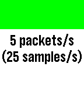
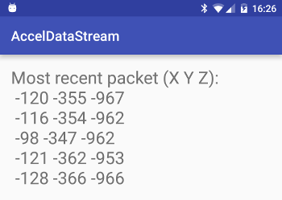

# accel-data-stream





Example app demonstrating how to stream accelerometer data using AppMessage
callbacks. To do this, accelerometer data is gathered via the AccelDataService:

```c
static void accel_data_handler(AccelData *data, uint32_t num_samples) {
  // ...

  send(data, num_samples);

  // ...
}
```

Each set of samples received is transmitted to the Android app for display via
AppMessage:

```c
static void send(AccelData *data, uint32_t num_samples) {
  if(comm_send_data(data, num_samples)) {
    
    // ...

  }
}
```

```c
bool comm_send_data(AccelData *data, uint32_t num_samples) {
  DictionaryIterator *out;
  AppMessageResult result = app_message_outbox_begin(&out);
  if(result == APP_MSG_OK) {
    for(uint32_t i = 0; i < num_samples; i++) {
      dict_write_int16(out, (COMM_NUM_PACKET_ELEMENTS * i) + 0, data[i].x);
      dict_write_int16(out, (COMM_NUM_PACKET_ELEMENTS * i) + 1, data[i].y);
      dict_write_int16(out, (COMM_NUM_PACKET_ELEMENTS * i) + 2, data[i].z);
    }

    if(app_message_outbox_send() == APP_MSG_OK) {
      s_busy = true;
      return true;
    }

    // ...

  }
}
```

The availability of the channel is tracked using AppMessage callbacks to prevent
transmission attempts before the previous packet has been acknowledged.

```c
static void outbox_sent_handler(DictionaryIterator *iterator, void *context) {
  // Message acknowledged, no longer busy
  s_busy = false;
}
```

```c
if(comm_is_busy()) {
  APP_LOG(APP_LOG_LEVEL_WARNING, "Accel sample arrived early");
  window_set_background_color(s_window, GColorRed);
} else {
  send(data, num_samples);
}
```
